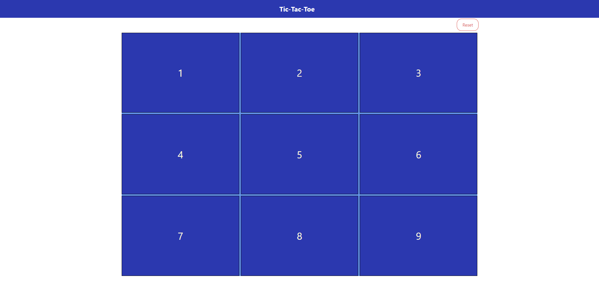

# Tic-Tac-Toe-Js

> Tic-Tac-Toe is a game for two players, X and O, who take turns marking the spaces in a 3×3 grid. The player who succeeds in placing three of their marks in a horizontal, vertical, or diagonal row is the winner.

## Built With

- HTML
- CSS
- JavaScript

## Live Demo

[Live Demo Link](https://rawcdn.githack.com/Eshy10/Tic-Tac-Toe-Js/0d160c06c660bbbca126e4adbdb5b231a07ef0f6/index.html)

## Usage

 - open index.html

## Authors

👤 **SpaYco**

- Github: [@SpaYco](https://github.com/SpaYco)
- Twitter: [@iSpaYco](https://twitter.com/iSpaYco)
- Linkedin: [Aziz Mejri](https://www.linkedin.com/in/spayco/)

👤 **Shola**

- Github: [@Eshy10](https://github.com/Eshy10)
- Twitter: [@AdesholaAdewal6](https://twitter.com/AdesholaAdewal6)
- Linkedin: [Adeshola Adewale ](https://www.linkedin.com/in/adewale-adeshola/)

## 🤝 Contributing

Contributions, issues and feature requests are welcome!

Feel free to check the [issues page](issues/).

## Show your support

Give a ⭐️ if you like this project!

## Acknowledgments

- Hat tip to anyone whose code was used
- Inspiration
- etc

## 📝 License

This project is [MIT](lic.url) licensed.